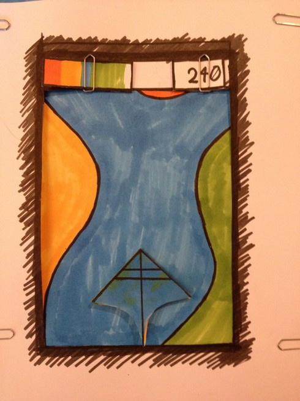
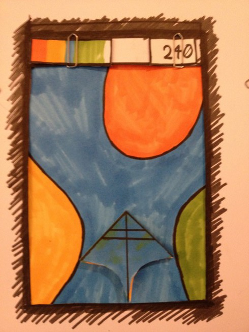
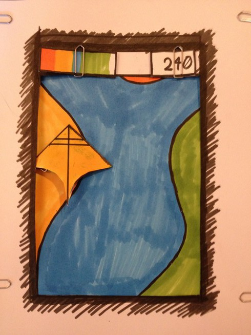
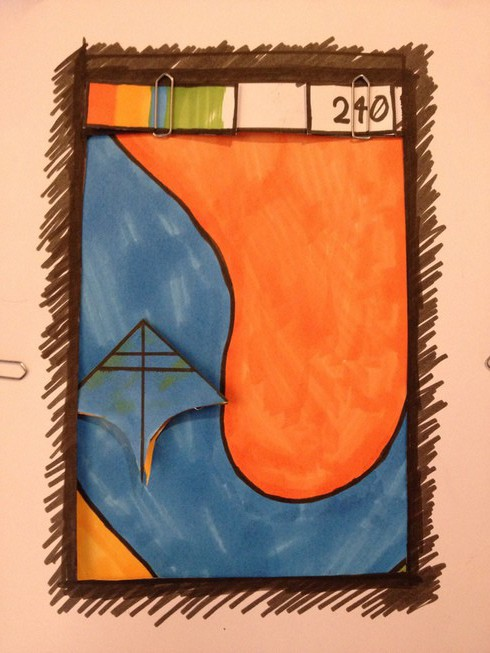
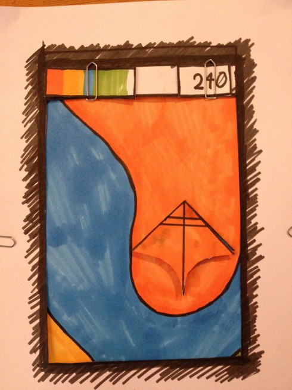
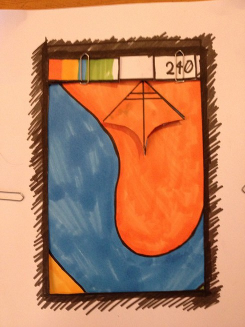

Codename "Color SHMUP"
======================

## Gameplay

Le gameplay de base est simple : il y a quatre types de terrain (quatre éléments / couleurs), et pour passer sur un type de terrain le personnage doit être du même type.

Exemple : il faut être bleu pour passer sur le terrain bleu (l'eau).

### Contrôles

Les déplacements se font comme dans un shoot'em'up :

- Auto-scroll vertical
- Déplacements libres sur la zone affichée à l'écran
- (légers déplacements latéraux de la zone affichée selon la position du joueur)

En plus du déplacement, il est possible de changer l'élément de son vaisseau -> air, terre, feu, eau.

### Défaite

Le joueur dispose d'une barre de points de vie. Cette barre se vide si le joueur rentre sur un terrain / élément différent du sien (i.e joueur eau sur un terrain feu). La barre se remplit si le joueur est sur son élément (joueur air sur terrain air).

La barre doit se remplir et se vider très vite, l'idée est que le changement d'élément ne peut pas être fait à la légère, qu'une erreur d'élément entraîne la mort.

### Victoire

Le joueur gagne des points.

### Points à débattre

Le gameplay de base est posé, il faudra l'enrichir afin de faire varier un peu l'expérience de jeu. J'ai plusieurs pistes, dont l'implémentation dépendra de la place restante.

#### Ennemis

Présence d'ennemis à tuer à l'aide de projectiles : à minima des ennemis basiques "obstacles", sinon une version plus complexe avec plusieurs types (couleurs / éléments).

On peut envisager un gameplay à la Ikaruga où la façon de tuer les ennemis varie selon leur élément et notre élément.

#### Système de score

Le score va probablement dépendre du temps de survie du joueur, mais pas que : par exemple, faut-il encourager les joueurs qui restent longtemps dans le même élément, ou bien ceux qui changent souvent d'élément (sans mourir, plus difficile).

## Inspiration

- [Ikaruga](http://store.steampowered.com/app/253750/)
- [Dragonsnake](http://js1k.com/2014-dragons/demo/1972)
- [Letterpaint](https://codepo8.github.io/letterpaint/)

